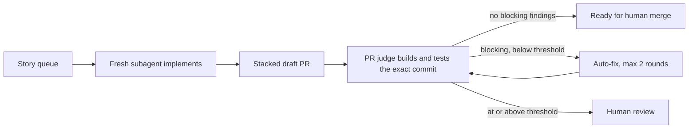

# Skills

The agent skills, commands, and guardrails I use every day to ship production software with **Claude Code**, **Codex**, and **OpenCode**. Write them once, deploy them to every tool.

- **Small context.** Skills load on demand. Only one-line descriptions sit in context at startup.
- **Guardrails.** Git writes need an explicit command. Nothing publishes without approval.
- **Measured.** Instruction changes are scored before and after, not eyeballed.

## Quick start

```bash
git clone https://github.com/delarooster/skills ~/repos/skills
cd ~/repos/skills
./setup.sh      # detects installed tools, prompts per tool (-y to accept all)
./cleanup.sh    # removes only what this repo deployed
```

Clone to `~/repos/skills`: commands reference that path. `./setup.sh help` lists per-tool targets. Then run `/startup` in any project.

## What's inside

| Path | Contents |
|---|---|
| `INSTRUCTIONS.md` | Global rules: session start, task tracking, git lockdown |
| `skills/` | On-demand skills (below) |
| `commands/` | `/startup`, `/begin`, `/clean`, `/git`, `/story-loop`, `/eval`, `/cs-init`, `/cs-work`, `/cs-decide` |
| `agents/pr-judge.md` | Independent pull request reviewer |
| `docs/` | Process guides, the eval framework, and eval reports |

**Workflow**

| Skill | Purpose |
|---|---|
| `story-loop` | Drain a story queue: fresh subagent per story, stacked PRs, independent verifier |
| `plan-project` | Break goals into epics and stories (the queue `story-loop` drains) |
| `tdd` | Red-green-refactor with behavior-focused tests |
| `git-conventions` | Branch, commit, and PR conventions |
| `cold-start` | Stateless sessions: read state, work, write state, exit |
| `wrap` | Close a session by recording state, not narrative |

**Infrastructure as Code**

| Skill | Purpose |
|---|---|
| `terraform` | Layout, typed and validated variables, tagging, and a plan/apply test strategy for `tofu test` |
| `bicep` | `existing` over `resourceId()`, hub/spoke private DNS, verbose naming |
| `bicep-modules` | Semver rules that detect interface changes before a module publishes |

## Story loop



The orchestrator never reads source, diffs, or logs, so its context stays flat across long runs. The judge is independent: it returns an evidence-backed verdict, never a patch.

```bash
bash skills/story-loop/scripts/selftest.sh    # state machine
bash skills/story-loop/scripts/e2e-chain.sh   # end-to-end chain in a throwaway repo
```

## Evals

`/eval` scores instruction files on six weighted dimensions: directive density, contradictions, redundancy, specificity, coverage, and token efficiency. Composite is out of 2.00. Reports live in [`docs/evals/`](docs/evals); the story-loop skill went from 1.20 to 1.65.

Framework: [docs/evaluation-framework.md](docs/evaluation-framework.md).

## License

[MIT](LICENSE)
